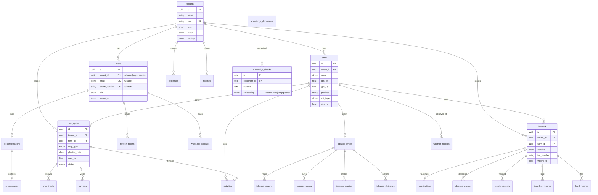

# Murimi OS — Entity Relationship Diagram

Single-database multi-tenancy: every business table carries `tenant_id`
(FK → `tenants.id`). `users.tenant_id` is nullable (Super Admin = platform-level);
`market_prices` / `knowledge_*` have a nullable `tenant_id` (NULL = global/shared).

## Table groups

| Domain         | Tables |
|----------------|--------|
| Tenancy / Identity | `tenants`, `users`, `refresh_tokens`, `whatsapp_contacts` |
| Farm           | `farms`, `activities` |
| Crop           | `crop_cycles`, `crop_inputs`, `harvests` |
| Tobacco        | `tobacco_cycles`, `tobacco_reaping`, `tobacco_curing`, `tobacco_grading`, `tobacco_deliveries` |
| Livestock      | `livestock`, `vaccinations`, `disease_events`, `weight_records`, `breeding_records`, `feed_records` |
| Finance        | `expenses`, `incomes`, `loans`, `input_credits` |
| Weather/Market | `weather_records`, `weather_alerts`, `market_prices` |
| AI / RAG       | `knowledge_documents`, `knowledge_chunks`, `ai_conversations`, `ai_messages`, `image_analyses` |
| ML / Sim       | `predictions`, `simulations` |
| Notifications  | `notifications`, `notification_preferences` |
